# rabbitmq
# Домашнее задание к занятию  «Очереди RabbitMQ» - Жаринов Павел

---

### Задание 1. Установка RabbitMQ

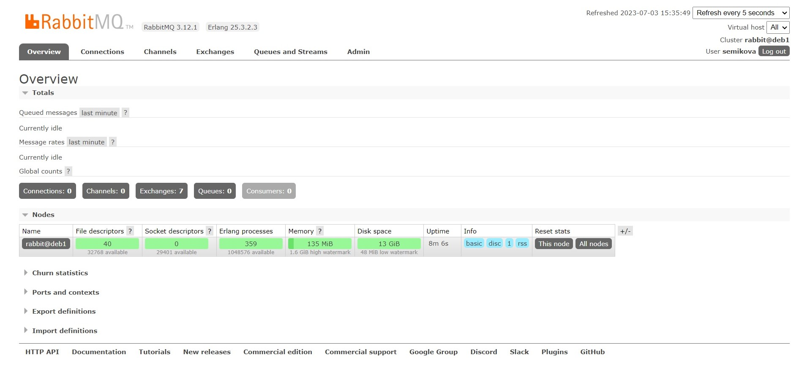
---

### Задание 2. Отправка и получение сообщений

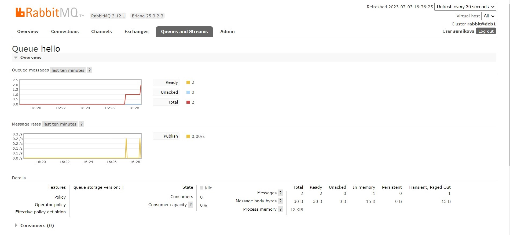
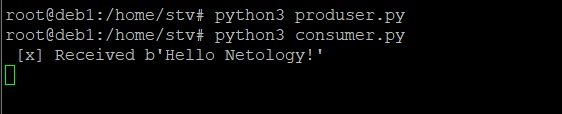

---

### Задание 3. Подготовка HA кластера

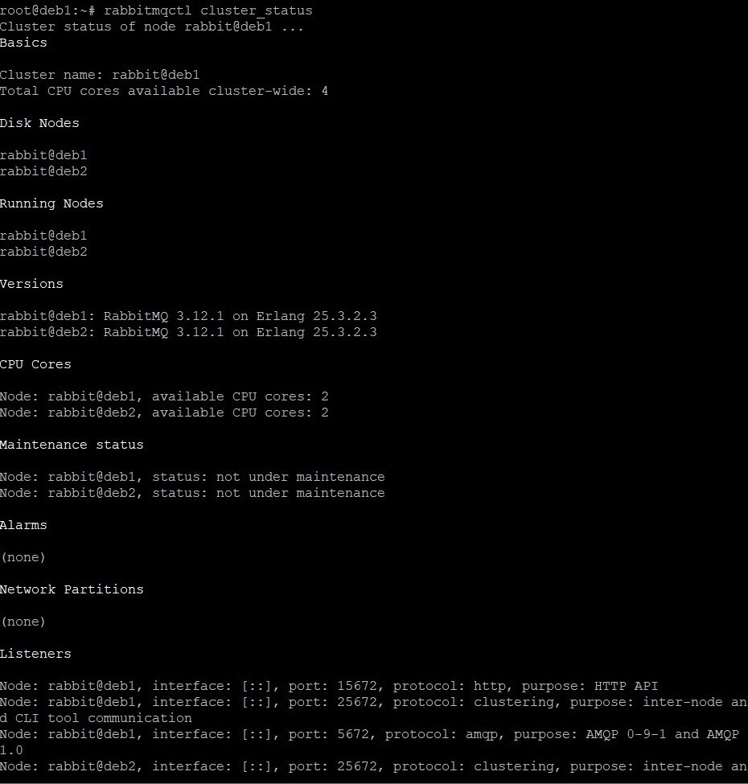
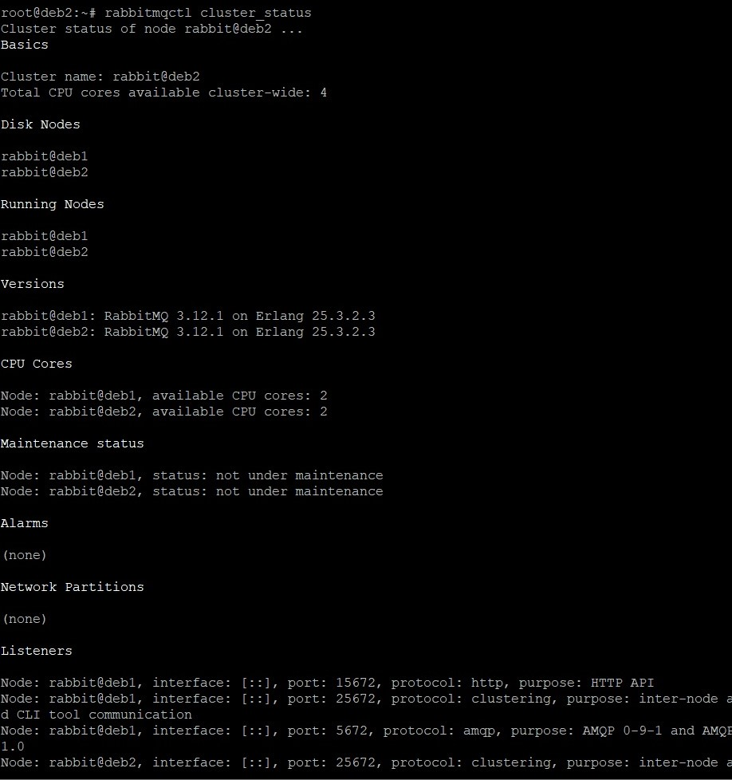
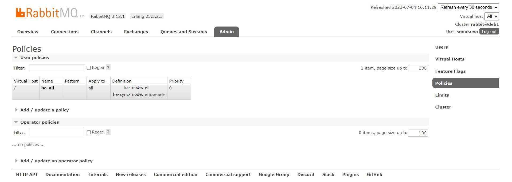
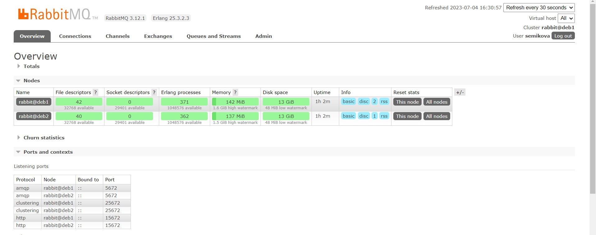
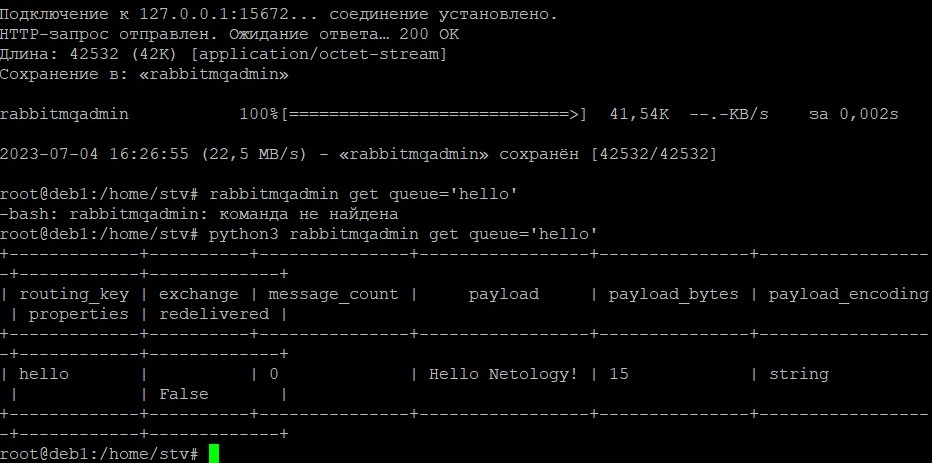
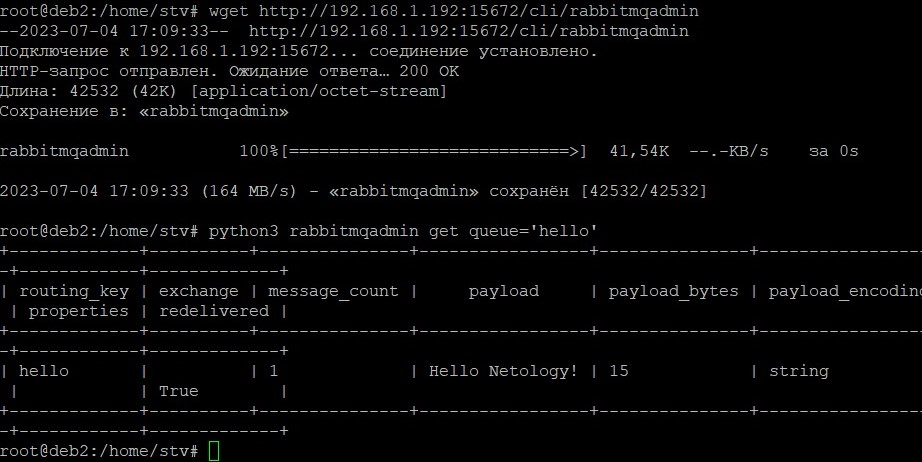
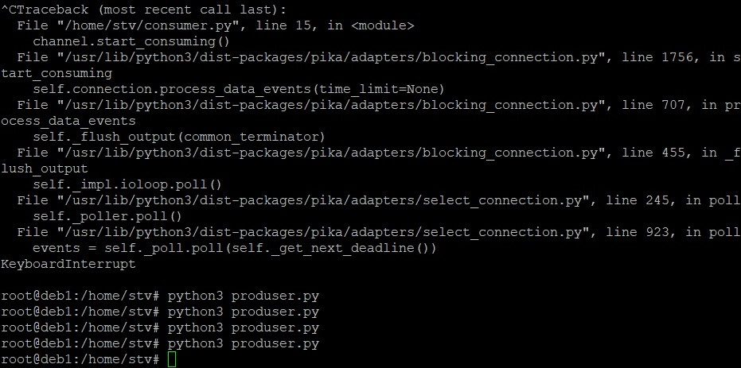
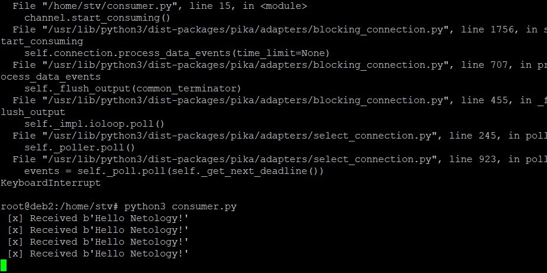
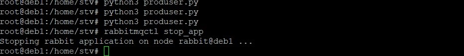
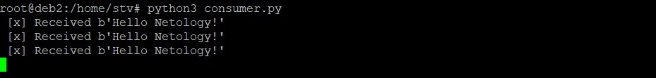
